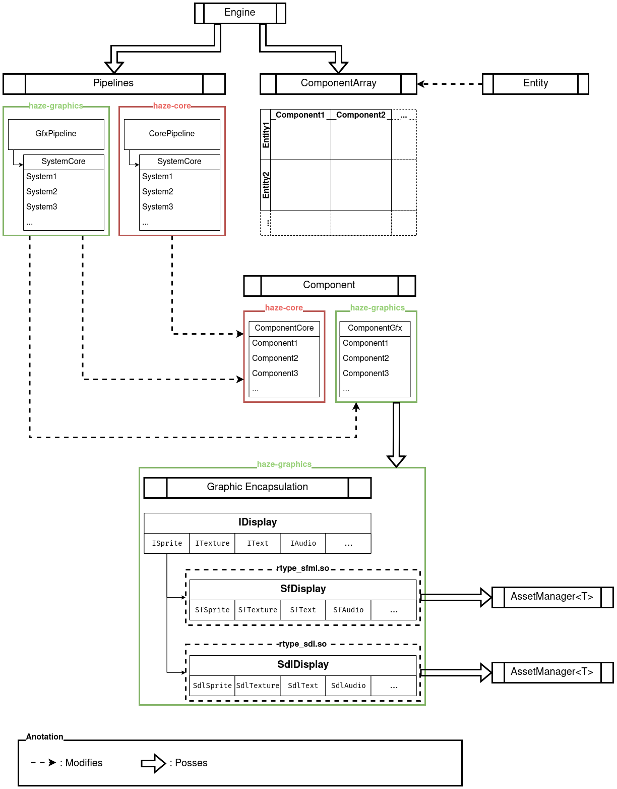

# Getting Started

## ECS
The Haze engine is a pure [ECS](ECS.md) with some little tweaks and additions.
An ECS architecture has many benefits for a game engine and that is why we chose to use it (benefits described at [ECS](ECS.md))

## Architecture


This is the full architecture of **Haze**.
As you can see we have the basics of an **ECS** such as Components, Entity and Systems.
If you want the technical documentation of these parts of Haze you can learn more at  [ComponentsGfx](ComponentGfx%20Technical.md), [ComponentsCore](ComponentCore%20Technical.md), [Entities](Entity%20Technical.md) and [Systems](System.md).

### Pipelines
We have also added [Pipelines](Pipeline.md) that allows to group systems hence allowing to differentiate easily systems that need additional libraries such as **SFML** from others that don't need it.

### Graphic Encapsulation
[Graphic encapsulation](Graphic_encapsulation.md) is also something that we have decided make in our engine. This addition makes it easy to change the graphic library of Haze.
These libraries are loaded from dynamic libraries and **SFML** and **SDL2** are currently supported in Haze.

### ComponentArray and Entity
Finally that entirety of the components of the engine is stored in a sigle class [ComponentArray](ComponentArray.md) which make the iteration of the component much faster and easier.

[Entities](Entity%20Technical.md) are just handlers  for the ComponentArray.

## Library
**Haze** is a currently composed of two different static libraries which are:
### haze-core
to include with
```cpp
#include <haze-core.hpp>
```

This library gather everything related to **basic** engine working such as **positions**, **velocity** or **collisions**.
This part of Haze doesn't require any external library to be functional and **can be imported in a server**.

### haze-graphic
to include with
```cpp
#include <haze-graphic.hpp>
```

This library gather everything related to the graphic part of the engine such as **displaying, getting inputs or playing audio**.
This part of Haze require the use of **SFML** to be functional and **cannot be imported in a server nor any system with no SFML install**.
