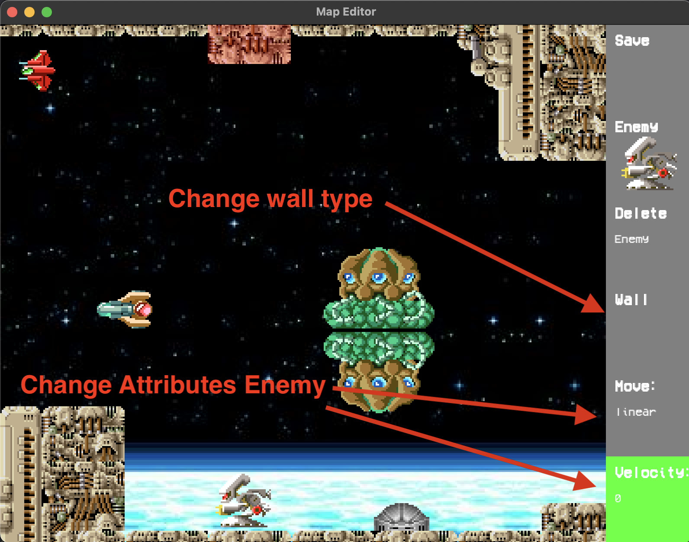
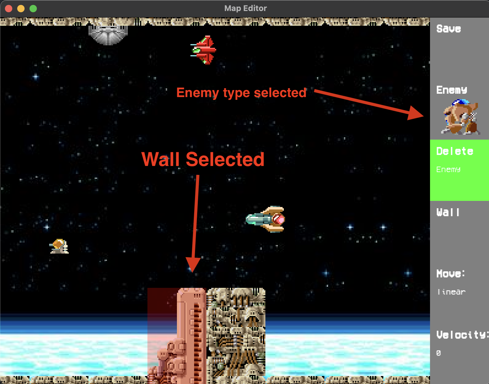

# Map Edior Documentation

This documentation outlines the process of creating maps for your game inside Rtype.
You can add walls and enemies to your maps using this editor.

## Map Interface

At left, you can see the map interface.
It's a preview of your map. You can add / delete walls with `j` `l` to select the wall.

You can select a wall with arrow keys. The wall will be highlighted in red.
`Note : if you select a wall out of the interface, the interface will move to the wall.`
Once selected, you can modify the wall with `i`

If you click on the map, you will add an enemy. The enemy will have the attributes selected in at right.

At right, you can see Buttons:
- `save` : save the map
- `enemy` : change the enemy type
- `delete enemy` : delete the last enemy added
- `wall` : change the wall type (load from `assets/json_files/walls`)
- `move` : change the movement type of the enemy (between "sinusoidal", "linear" and "circular")
- `velocity` : change the velocity of the enemy (between some predefined values)

